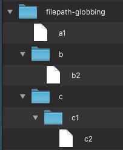

<div class="licence">
<span>Licence CC BY-NC-ND</span>
<span>Thierry Parmentelat</span>
<span></span>
</div>

+++

# les fichiers

+++ {"slideshow": {"slide_type": "slide"}}

* lire et écrire un fichier est très facile en Python
* ouvrir un fichier pour créer un objet "fichier"
* `open('mon_fichier.txt', 'r')`
  * `'r'` ouvre le fichier en lecture (défaut),
  * `‘w’` en écriture,
  * `‘a’` en écriture à la suite (*append*),

+++ {"slideshow": {"slide_type": "slide"}}

## utilisez un `with`

+++

* prenez l'habitude de **toujours utiliser un context manager**

```{code-cell} ipython3
# on n'a pas encore étudié l'instruction with
# mais je vous conseille de toujours procéder comme ceci

# avec with on n'a pas besoin de fermer le fichier
with open('temporaire.txt', 'w') as f:
    for i in 10, 20, 30:
        f.write(f'{i} {i**2}\n')
```

```{code-cell} ipython3
!cat temporaire.txt
```

+++ {"slideshow": {"slide_type": "slide"}}

## lecture avec `for`

+++

* l'objet fichier est un **itérable** lui-même
* on peut faire un `for` dessus
* **attention** toutefois, les lignes vont contenir un caractère `"\n"` de fin de ligne

```{code-cell} ipython3
:cell_style: split

# lire un fichier texte ligne par ligne
# on ne peut pas faire plus compact et lisible !

# remarquez aussi:
# open() sans le mode ⇔ open('r')

with open('temporaire.txt') as f:
    for line in f:
        print(f"-- {line}", end='') 
```

```{code-cell} ipython3
:cell_style: split

# si on ne fait rien
# on obtient 2 fins de ligne
# i.e. une ligne blanche

with open('temporaire.txt') as f:
    for line in f:
        print(f"-- {line}") 
```

+++ {"slideshow": {"slide_type": "slide"}}

## fichiers texte ou binaire

+++

* ajouter `'b'` au mode pour ouvrir **en binaire**
  * pas de décodage
  * travaille alors à base de **`bytes`** et non de `str`

```{code-cell} ipython3
---
cell_style: center
slideshow:
  slide_type: slide
---
# j'ai besoin d'un objet bytes
# rappelez vous la section sur Unicode
text = "noël en été\n"
binaire = text.encode(encoding="utf-8")

binaire
```

```{code-cell} ipython3
:cell_style: center

# remarquez le 'b' dans le mode d'ouverture

with open('temporaire.bin', 'wb') as out_file:
    # je peux du coup écrire un objet bytes
    out_file.write(binaire)
```

```{code-cell} ipython3
!cat temporaire.bin
```

```{code-cell} ipython3
---
slideshow:
  slide_type: slide
---
# pareil en lecture, le mode avec un 'b'
# va faire que read() retourne un objet bytes

with open('temporaire.bin', 'rb') as in_file:
    binaire2 = in_file.read()
```

```{code-cell} ipython3
---
slideshow:
  slide_type: ''
---
# et donc on retombe bien sur nos pieds
binaire2 == binaire
```

+++ {"slideshow": {"slide_type": "slide"}, "tags": ["level_intermediate"]}

## le module `pathlib`

+++ {"slideshow": {"slide_type": "-"}}

### objectifs

* simplifier la gestion des noms de fichier 
* pour rendre le code plus concis
* et donc plus lisible
* sous-titre: *object-oriented filesystem paths*
* en remplacement de librairies plus anciennes
  * `os.path`, `os`, `glob`... 

+++ {"slideshow": {"slide_type": "slide"}}

### un exemple

```{code-cell} ipython3
:cell_style: split

# savoir si un chemin correspond à un dossier
from pathlib import Path

tmp = Path("temporaire.txt")

if tmp.is_file():
    print("c'est un fichier")
```

```{code-cell} ipython3
:cell_style: split

# donc on peut l'ouvrir

with tmp.open() as feed:
    for line in feed:
        print(line, end="")
```

### construire un objet `Path`

```{code-cell} ipython3
:cell_style: split

# un chemin absolu
prefix = Path("/etc")

# le chemin absolu du directory courant
dot = Path.cwd()

# ou du homedir
home = Path.home()

# un nom de ficher
filename = Path("apache")
```

```{code-cell} ipython3
:cell_style: split

# par exemple le répertoire courant est

dot
```

+++ {"slideshow": {"slide_type": "slide"}}

### l'opérateur `/`

+++

un exemple intéressant de surcharge d'opérateur - ici `/`  
selon le type de ses opérandes, `/` fait .. ce qu'il faut  
par exemple ici on ne fait pas une division !

```{code-cell} ipython3
:cell_style: center

# Path / Path -> Path bien sûr
type(prefix / filename)
```

```{code-cell} ipython3
---
cell_style: split
slideshow:
  slide_type: slide
---
# Path / str -> Path
type(prefix / "apache2")
```

```{code-cell} ipython3
:cell_style: split

# str / Path -> Path
type("/etc" / Path("apache2"))
```

```{code-cell} ipython3
# mais bien sûr str / str -> TypeError
try:
    "/etc" / "apache2"
except Exception as e:
    print("OOPS", e)
```

+++ {"slideshow": {"slide_type": "slide"}}

### calculs sur les chemins

+++ {"cell_style": "split"}

j'ai créé un petite hiérarchie de fichiers dans un dossier `filepath-globbing` qui ressemble à ceci

+++ {"cell_style": "split"}



```{code-cell} ipython3
---
slideshow:
  slide_type: slide
---
# voilà comment on peut d'abord trouver son chemin absolu

globbing = Path("filepath-globbing")
absolute = globbing.absolute()
absolute
```

```{code-cell} ipython3
# si on a besoin d'un str, comme toujours il suffit de faire
str(absolute)
```

```{code-cell} ipython3
# les différents morceaux de ce chemin absolu
absolute.parts
```

```{code-cell} ipython3
:cell_style: split

# juste le nom du fichier, sans le chemin
absolute.name
```

```{code-cell} ipython3
:cell_style: split

# le chemin, sans le nom du fichier
absolute.parent
```

```{code-cell} ipython3
# tous les dossiers parent

list(absolute.parents)
```

+++ {"slideshow": {"slide_type": "slide"}}

### pattern-matching

```{code-cell} ipython3
---
cell_style: center
slideshow:
  slide_type: ''
---
# est-ce que le nom de mon objet Path 
# a une certaine forme ?

absolute.match("**/notebooks/*")
```

```{code-cell} ipython3
absolute.match("**/*globbing*")
```

+++ {"slideshow": {"slide_type": "slide"}}

#### pattern-matching - suite

+++ {"cell_style": "split"}

recherche dans un répertoire

```{code-cell} ipython3
:cell_style: split

# un répertoire qui contient quelques fichiers
!ls filepath-globbing/**
```

```{code-cell} ipython3
---
slideshow:
  slide_type: slide
---
# à présent c'est plus intéressant
# avec des chemins relatifs
globbing = Path("filepath-globbing")

list(globbing.glob("*"))
```

```{code-cell} ipython3
list(globbing.glob("*[0-9]"))
```

```{code-cell} ipython3
list(globbing.glob("**"))
```

```{code-cell} ipython3
list(globbing.glob("**/*[0-9]"))
```

```{code-cell} ipython3
str(globbing)
```
