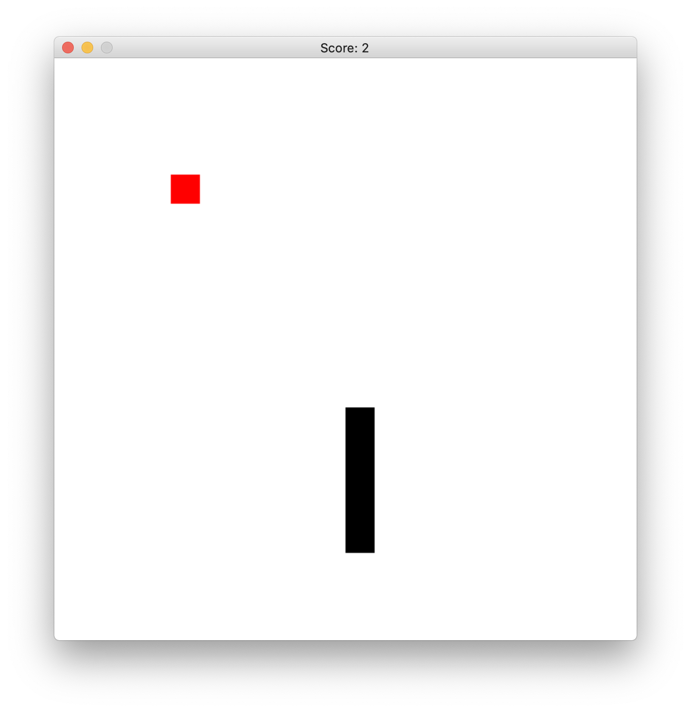

# Quelques petits jeux

## Le Snake

Le but de ce TP est de réaliser un petit jeu en Python.
L'objectif est de vous apprendre à concevoir et réaliser un programme complet, et non de réaliser le nouveau best-seller.

Gardez ainsi en tête que votre objectif est de réaliser un **programme qui marche** et pas un programme parfait.

### Prérequis

_Ce qui suit suppose que vous avez installé Python avec `conda` et que vous avez un terminal fonctionnel sur votre ordinateur._

Commencez par créer et activer un environnement dédié au TP:

```sh
# on commence par créer un environnement "snake"
(base) $ conda create -n snake pip
# puis on l'active
(base) $ conda activate snake
# votre terminal doit indiquer le nom d'environnement:
(snake) $
```

Installez ensuite la dernière version du module `pygame` avec `pip`:

```sh
(snake) $ pip install pygame==2.0.0.dev12
```

Pour tester votre installation, vous pouvez lancer le programme d'exemple comme suit:

```sh
(snake) $ python -m pygame.examples.aliens
```

### Code de démarrage

Un premier code très simple est le suivant, écrivez-le dans un fichier `snake.py` et lancez-le avec la commande `python`:

**ATTENTION** je vous recommande de **ne pas essayer d'exécuter ce code depuis un notebook** :
ni depuis nbhosting, ça ne marchera pas du tout, car `pygame` n'y est pas installé;
ni depuis votre ordinateur personnel, car vous allez rencontrer des problèmes mystérieux de kernel qui meurt, si vous essayez.

```python
import pygame as pg
from random import randint

# on initialise pygame et on crée une fenêtre de 400x300 pixels
pg.init()
screen = pg.display.set_mode((400, 300))

# on crée aussi un objet "horloge"
clock = pg.time.Clock()

# enfin on boucle à l'infini pour faire le rendu de chaque image
while True:
    # l'objet "clock" permet de limiter le nombre d'images par secondes
    # ici pour cette démo on demande 1 image par seconde
    clock.tick(1)

    # on génère une couleur (Rouge, Vert, Bleu) au hasard
    random_color = (randint(0, 255), randint(0, 255), randint(0, 255))
    # et on colorie l'écran avec cette couleur
    screen.fill(random_color)

    # enfin on met à jour la fenêtre avec tous les changements
    pg.display.update()

pg.quit()
```

Vous pouvez désormais exécuter le programme avec:

```sh
(snake) $ python snake.py
```

**Attention** : vous verrez que vous ne pouvez pas _fermer_ la fenêtre normalement, pour quitter votre programme vous devez saisie **CONTROL+C** dans le terminal.

Afin d'avoir un comportement plus "normal", nous devons instruire Pygame en lui disant comment réagir aux clicks sur le clavier ou sur la fenêtre:

```python
import pygame as pg
from random import randint

pg.init()
screen = pg.display.set_mode((400, 300))
clock = pg.time.Clock()

# on rajoute une condition à la boucle: si on la passe à False le programme s'arrête
running = True
while running:
    clock.tick(1)

    # on itère sur tous les évênements qui ont eu lieu depuis le précédent appel
    # ici donc tous les évènements survenus durant la seconde précédente
    for event in pg.event.get():
        # chaque évênement à un type qui décrit la nature de l'évênement
        # un type de pg.QUIT signifie que l'on a cliqué sur la "croix" de la fenêtre
        if event.type == pg.QUIT:
            running = False
        # un type de pg.KEYDOWN signifie que l'on a appuyé une touche du clavier
        elif event.type == pg.KEYDOWN:
            # si la touche est "Q" on veut quitter le programme
            if event.key == pg.K_q:
                running = False

    random_color = (randint(0, 255), randint(0, 255), randint(0, 255))
    screen.fill(random_color)

    pg.display.update()

# Enfin on rajoute un appel à pg.quit()
# Cet appel va permettre à Pygame de "bien s'éteindre" et éviter des bugs sous Windows
pg.quit()
```

### À vous de jouer

Nous allons commencer par construire notre plateau de jeu ainsi:
- le plateau de jeu est découpe en 30x30 cases
- chaque case fait 30 pixels de côté

Pour valider le bon fonctionnement de ce plateau de jeu, écrivez un programme qui dessine un grille:


pour cela, vous pouvez utiliser la méthode [`pg.draw.rect()`](https://www.pygame.org/media/ref/draw.html#pygame.draw.rect) qui dessine un rectangle:

```python
# les coordonnées de rectangle que l'on dessine
x = 100 # coordonnée x (colonnes) en pixels
y = 100 # coordonnée y (lignes) en pixels
width = 30 # largeur du rectangle en pixels
height = 30 # hauteur du rectangle en pixels
rect = pg.Rect(x, y, width, height)
# appel à la méthode draw.rect()
color = (255, 0, 0) # couleur rouge
pg.display.rect(screen, color, rect)
```

L'étape suivante est de dessiner le serpent. Le serpent est simplement une suite de blocks de couleurs.
On veut dessiner le serpent aux coordonnées suivantes:

```python
# les coordonnées du corps du serpent
serpent = [
    (10, 15),
    (11, 15),
    (12, 15),
]
```

pour obtenir un schéma comme suit:


Ensuite, nous allons faire bouger le serpent.
C'est en fait très simple:
- nous créons un vecteur de "direction"
  ```python
  direction = (1, 0)
  ```
- à chaque itération de la boucle, nous pouvons déplacer le serpent dans cette direction en "ajoutant" ce vecteur à la position de la tête du serpent

Un fois que le serpent bouge, ajouter les commandes pour de déplacer dans les 4 directions, en cliquant sur les flèches

**BONUS** faites en sorte que le serpent ne puisse pas faire "demi tour"

  

Il faut maintenant faire manger notre serpent.
On va procéder comme suit:

- on a toujours la position du serpent dans une variable `serpent` :
- on génère un "fruit", dans une position aléatoire
  ```python
  # exemple de fruit en position 10, 10 sur le plateau
  fruit = (10, 10)
  ```
- quand la tête du serpent mange le fruit, on place un nouveau fruit à une position aléatoire et on allonge le serpent d'une case


Il nous reste deux petits changements pour avoir un serpent complètement fonctionnel:

- tout d'abord il faut détecter si le serpent se mord la queue, ce qui est une condition d'échec
- enfin on peut afficher le score.
  La façon la plus simple de procéder est de changer le titre de la fenêtre, avec la fonction `set_caption()`:
  ```python
  score = 0
  pg.display.set_caption(f"Score: {score}")
  ```

  

## Un second jeu: le flappy bird

Ce second exemple va nous permettre de nous confronter à un cas plus compliqué de jeu vidéo:
- l'espace de jeu n'est plus "discret": on n'avance plus case après case mais "continuement" à une vitesse donnée
- on va afficher des images et non des simples carrés de couleur
- on va devoir se poser la question de la collision entre l'oiseau et les éléments du décor

### Code de démarrage

Il est semblable au code de démarrage précédent:

```python
import pygame as pg

BG_BLUE = (0, 195, 204)

pg.init()
screen = pg.display.set_mode((640, 480))
clock = pg.time.Clock()

running = True
while running:
    clock.tick(30)

    # 1. lecture des évênements
    for event in pg.event.get():
        if event.type == pg.QUIT:
            running = False

    # 2. actions

    # 3. rendu
    screen.fill(BG_BLUE)
    pg.display.update()

pg.quit()
```

### À vous de jouer

La première action à mener est de dessiner notre oiseau (de malheur ?).
Pour dessiner une image en pygame, deux actions sont nécessaires:

- on doit charger l'image depuis un fichier, par ex.
  ```python
  image = pg.image.load("chemin/vers/image.png")
  ```
- puis on l'affiche, en donnant les coordonnées de son coin supérieur gauche:
  ```python
  # cette instruction va écraser ce qui se trouve en (100, 100) avec l'image
  screen.blit(image, (10, 10))
  ```

vous devriez avoir un rendu semblable à celui-ci:


Il faut maintenant faire bouger notre oiseau.
Contrairement à l'exemple précédent, nous allons devoir utilisé un mouvement "continu", c'est à dire caractérisé par:
- l'accélération de la pesanteur (quelle unité ?)
- la vitesse de déplacement horizontale de l'oiseau (quelle unité ?)

Pour cela nous allons avoir besoin d'une notion de temps. Celle-ci va nous être conné par l'objet `clock` (plûtot logique !) qui retourne à chaque appel à `tick` le nombre de millisecondes écoulées depuis la dernière invocation, soit:

```python
# delta_ms contient le nombre de ms depuis la dernière invocation
delta_ms = clock.tick(30)
```

du coup l'algorithme a réaliser est le suivant:
- ajouter une variable pour la vitesse instantannées de l'oiseau
- une constant pour la gravité
- à chaque itération, mettez en jour la vitesse et la position de l'oiseau avant de l'afficher

Vous devriez obtenir quelque chose comme:


_il vous revient d'adapter les différentes constantes pour avoir une "sensation" de jeu agréable_

L'étape suivant est de définir une interraction avec l'oiseau. Le fonctionnement proposé est simple:
- quand l'utilisateur clique sur espace, l'oiseau reçoit une "impulsion" vers le haut qui va combattre la gravité
- et on anime l'oiseau en conséquence

Le résultat doit être semblable à:


